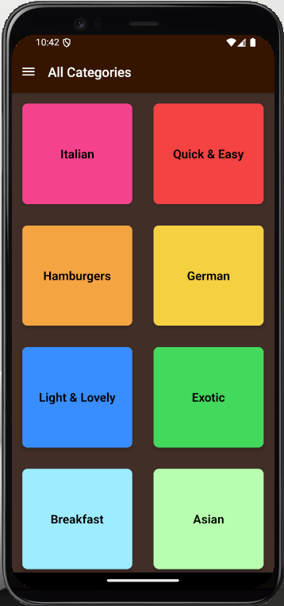
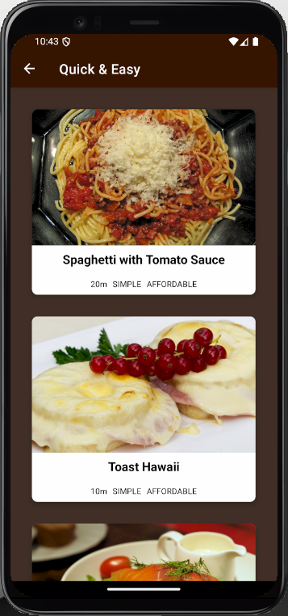
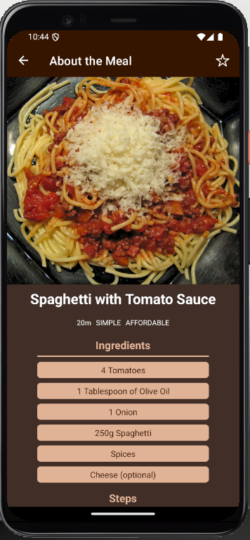
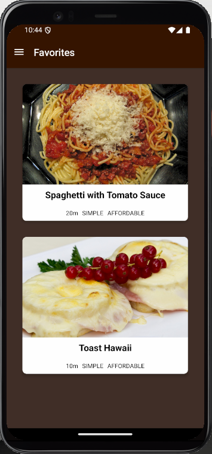

# 🍽️ MealsApp

MealsApp is a React Native application that allows users to explore meals by categories, view meal details, and save favorite meals. The app is designed to demonstrate navigation, state management, and reusable components in React Native.

---

## 📋 Table of Contents

- [Features](#features)
- [Screenshots](#screenshots)
- [Installation](#installation)
- [Usage](#usage)

---

## ✨ Features

- Browse meals by category
- View meal details (ingredients, steps, etc.)
- Mark and unmark meals as favorites
- Smooth navigation between screens
- Clean and responsive UI

---

## 📸 Screenshots

> *(Add screenshots here if available)*  
> Example:
> 
> 
> 
> 

---

## ⚙️ Installation

### 1. Clone the Repository
```bash
git clone https://github.com/Loaytamer/MealsApp.git
cd MealsApp
```
### 2. Install Dependencies
```bash
npm install
# or
yarn install
```
### 3. Run the App
```bash
npx expo start
```

---

## 🚀 Usage
- Launch the app on your emulator or physical device.

- Browse the meal categories on the home screen.

- Tap a category to view meals within it.

- Select any meal to see its details like ingredients and preparation steps.

- Tap the "star" icon to mark it as a favorite.
